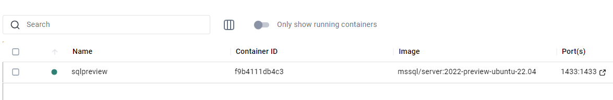
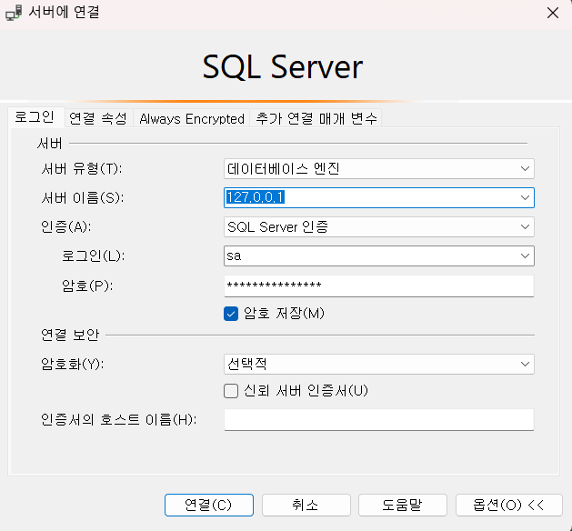

# MS SQL Server 입문 (1)

### 목차

1. Background
2. MS SQL Server 설치
3. SSMS 설치
4. MSSQL 기본구조
5. MS SQL 기본 구조 및 활용

---

### 1. Background

MS SQL Server에 대해서 이해할 필요가 있어서, 해당 내용을 정리하는 중입니다.

---

### 2. MS SQL Server 설치

Docker hub의 [MS SQL Server](https://hub.docker.com/r/microsoft/mssql-server)를 활용하여 쉽게 설치 할 수 있었습니다.

```bash
docker pull mcr.microsoft.com/mssql/server #이미지 pull
docker run -e "ACCEPT_EULA=Y" -e "MSSQL_SA_PASSWORD=사용할 비밀번호" -e "MSSQL_PID=Evaluation" -p 1433:1433  --name sqlpreview --hostname sqlpreview -d mcr.microsoft.com/mssql/server:2022-preview-ubuntu-22.04
#MSSQL Server 컨테이너 실행
```

docker 실행 화면



---

### 3. SSMS 설치

일반적으로 Jetbrain의 Datagrip이나 Dbeaver를 활용하여 연결 할 수도 있지만, [MSSQL Server](https://learn.microsoft.com/ko-kr/sql/ssms/download-sql-server-management-studio-ssms?view=sql-server-ver16)를 사용할 시에 지원되는 모니터링, 쿼리, 디자인 관리를 지원해주는 역할이 크다고 생각되어 선택하게 되었습니다.

연결정보 입력



---

### 4. MSSQL 기본 구조

---

### 5. MSSQL 기본 구조 및 활용

[MSSQL Sample Database](https://github.com/Microsoft/sql-server-samples/tree/master/samples/databases/northwind-pubs)링크에 있는 sql파일을 활용해볼 것입니다.

instpubs.sql 파일을 다운로드 받고 sql문을 실행합니다.

실행 후 pubs 데이터베이스가 생성됩니다.

- 테이블 생성

```
-- CREATE TABLE memberTbl (
--   컬럼명1 데이터형식 제약조건(NOT NULL),
--   컬럼명2 데이터형식 제약조건,
--   컬럼명3 데이터형식 제약조건
-- );


-- ex)

CREATE TABLE memberTbl (
  mem_id varchar(10) PRIMARY KEY, -- 영문만 입력되는게 명확하다면 varchar
  mem_name nchar(10) NOT NULL,    -- nchar 는 한글이 들어올 수 있는 경우
  mem_gender char(1) NOT NULL,    -- 영문만 입력되는게 명확하다면 varchar
  mem_join date NOT NULL,         -- date 형식
  mem_address nvarchar(90),       -- null 허용, 한글이 저장되기 때문에 nvarchar
  mem_email varchar(90) NOT NULL  -- 영문만 입력되는게 명확하다면 varchar
);

```

* 테이블 컬럼 추가

```
-- 추가
-- ALTER TABLE memberTbl
--   ADD 컬럼명1 데이터형식 제약조건(NOT NULL)
-- GO

-- ex) 컬럼 추가 - 새로운 컬럼은 마지막에 추가 됩니다.
ALTER TABLE memberTbl
  ADD mem_point int NULL -- null 허용
GO

ALTER TABLE memberTbl
  -- ADD mem_point int NOT NULL                  -- NOT NULL 을 추가 할 경우 DEFAULT 구문이 없으면 에러 발생
  ADD mem_point int DEFAULT('0') NOT NULL        -- 에러를 없애려면 DEFAULT 값을 주면 됩니다.
  -- ADD mem_point int IDENTITY(1, 1) NOT NULL   -- 자동 증가값 IDENTITY(1, 1) 을 적용해 1씩 증가값을 줄 수도 있습니다. IDENTITY(1, 2) 를 하면 1부터 2씩 증가
GO

-- 여러 열 추가시 ADD 는 한번만 써주면 됩니다.
ALTER TABLE memberTbl
  ADD
    mem_point int NULL,  -- null 허용
    mem_point2 int NULL, -- null 허용
    mem_point3 int NULL  -- null 허용
GO
```

* 테이블 컬럼 삭제

```
-- 삭제
-- ALTER TABLE memberTbl
--   DROP COLUMN 컬럼명
-- GO

-- ex) 컬럼 삭제 - 해당 컬럼을 삭제 합니다.
ALTER TABLE memberTbl
  DROP COLUMN mem_point
GO

-- 여러 열 삭제
ALTER TABLE memberTbl
  DROP COLUMN
    mem_point,
    mem_point2,
    mem_point3
GO

```

* 테이블 컬럼 데이터 형식 변경

```
ALTER TABLE dbo.memberTbl
  ALTER COLUMN mem_point smallint;
```
